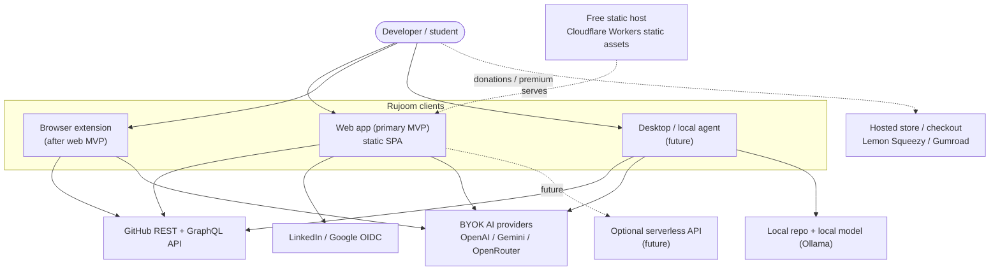
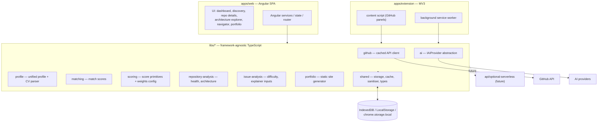
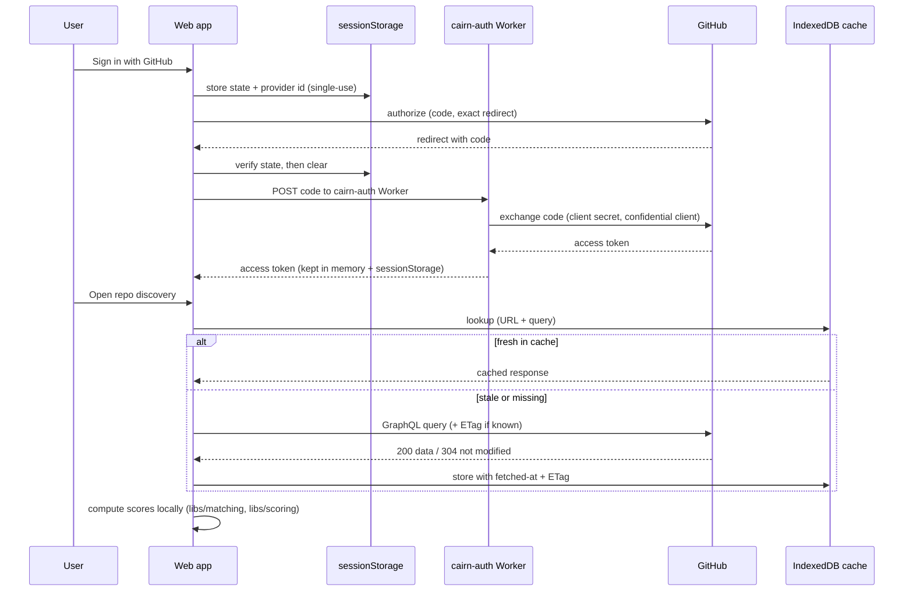
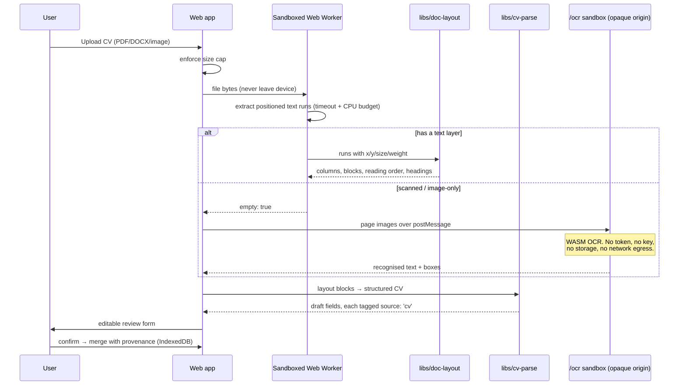
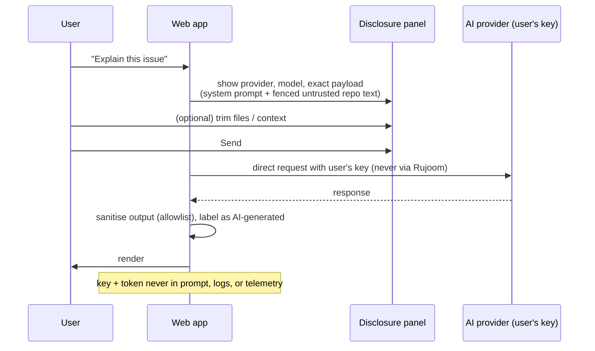
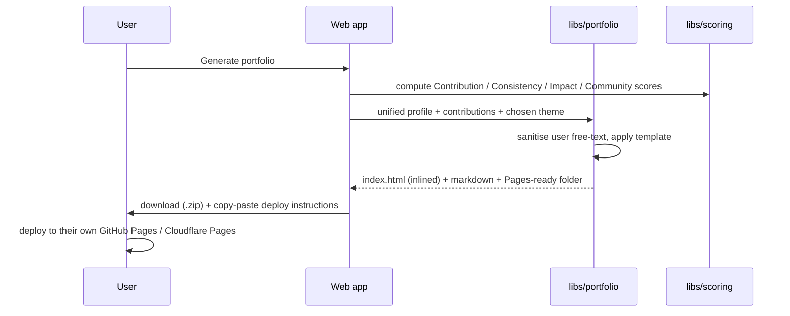
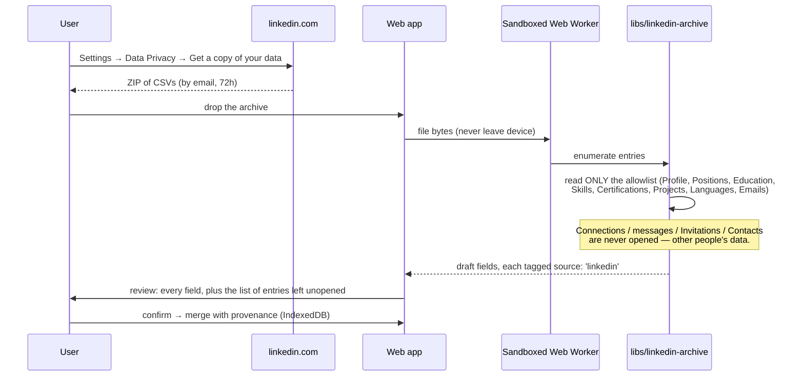
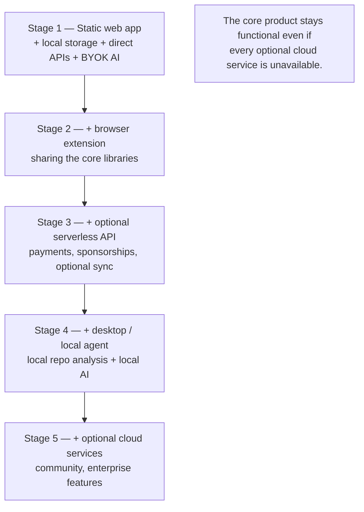

# Rujoom — Architecture Overview

This is the entry point for the Rujoom architecture. It gives the system
picture and links to the deeper documents:

- **Decisions:** [`docs/adr/`](docs/adr/README.md) — 33 Architecture Decision Records.
- **Data sources:** [`docs/data-sources.md`](docs/data-sources.md) — what each source
  actually exposes, and why.
- **Design:** [`docs/design-system.md`](docs/design-system.md) · **Testing:**
  [`docs/testing.md`](docs/testing.md).
- **Security:** [`SECURITY.md`](SECURITY.md) — trust model, threat model, controls.
- **CI/CD:** [`docs/ci-cd.md`](docs/ci-cd.md) — pipeline and gates.
- **Working guide:** [`PROJECT_GUIDE.md`](PROJECT_GUIDE.md) — current status and conventions.

## 1. Product summary & positioning

Rujoom helps students, junior developers, and developers in emerging
markets discover suitable open-source projects, understand unfamiliar codebases, make
meaningful contributions, and turn those contributions into professional opportunities.

The product is organised around five questions:

1. **Who am I?** — one editable developer profile merged from four sources — GitHub
   (deep read over GraphQL), a LinkedIn data-export archive, a CV, and manual entry —
   with **per-field provenance**, where a hand edit always outranks an import
   ([ADR-0031](docs/adr/0031-profile-v2-provenance.md)).
2. **What should I contribute to?** — repository and issue discovery.
3. **Why is it a good match?** — deterministic, explainable match and health scores.
4. **How do I start?** — the Open Source Copilot (architecture explorer, issue
   explainer, contribution navigator).
5. **How do I showcase my progress?** — a generated contributor portfolio.

## 2. Architecture principles

| Principle | Consequence | ADR |
|-----------|-------------|-----|
| **Local-first** | Core product runs in the browser against third-party APIs + local storage | [0001](docs/adr/0001-local-first-zero-cost-architecture.md) |
| **$0 operating cost for the MVP** | Static hosting, no backend, no DB, no Rujoom AI bill | [0001](docs/adr/0001-local-first-zero-cost-architecture.md), [0004](docs/adr/0004-static-first-web-app-on-free-hosting.md) |
| **No mandatory backend** | Server code only as stateless serverless functions, added per concrete need | [0002](docs/adr/0002-no-mandatory-application-backend.md), [0016](docs/adr/0016-optional-serverless-api.md) |
| **No mandatory database** | IndexedDB + LocalStorage; sync deferred | [0003](docs/adr/0003-no-mandatory-database-local-first-storage.md) |
| **Maximum browser/device computation** | Matching, health, CV parsing, portfolio generation all client-side | [0007](docs/adr/0007-deterministic-explainable-matching-engine.md), [0008](docs/adr/0008-ai-free-repository-health-engine.md), [0011](docs/adr/0011-local-first-cv-processing.md), [0013](docs/adr/0013-client-side-portfolio-generation.md) |
| **Direct third-party APIs** | Call GitHub directly with the user's token; no proxy | [0006](docs/adr/0006-direct-github-api-usage.md) |
| **BYOK AI, optional** | Users bring their own key; a useful non-AI mode always exists | [0009](docs/adr/0009-byok-ai-optional-enhancement.md) |
| **Security first** | Strict CSP, sanitisation, origin-allowlisted OAuth exchange, minimal deps, CI gates — the #1 requirement | [0019](docs/adr/0019-security-first-rendering.md), [0020](docs/adr/0020-oauth-token-and-byok-key-handling.md), [0021](docs/adr/0021-supply-chain-and-dependency-security.md) |
| **CI/CD from day one** | Pipeline is the only path to prod; security gates block merge | [0022](docs/adr/0022-ci-cd-is-mandatory-infrastructure.md) |
| **Evolve, don't rewrite** | Shared core libraries; each new client/service is an addition | [0005](docs/adr/0005-angular-typescript-shared-core-monorepo.md) |

## 3. System context (C4 level 1)



## 4. Container view (C4 level 2)



## 5. Shared core / monorepo layout

Single Git monorepo, npm workspaces, TypeScript `strict`
([ADR-0005](docs/adr/0005-angular-typescript-shared-core-monorepo.md)):

```
OpenSourceCompass/
├── apps/
│   ├── web/                  # Angular SPA — the primary MVP
│   │   ├── src/styles/       # design tokens — the one source of visual truth
│   │   ├── src/app/ui/       # cn-* component library
│   │   ├── src/app/features/ # one folder per feature: container + presentational
│   │   └── public/ocr/       # isolated OCR sandbox: own CSP, opaque origin
│   ├── extension/            # MV3 browser extension (after web MVP)
│   └── desktop/              # future — Tauri shell + local analysis
├── libs/
│   ├── github/               # cached, deduped, rate-limit-aware GitHub client (REST + GraphQL)
│   ├── profile/              # unified profile model + provenance merge, skills taxonomy
│   ├── cv-extract/           # CV bytes -> text + positioned layout runs
│   ├── doc-layout/           # pure: positioned runs -> columns, blocks, reading order
│   ├── cv-parse/             # pure: layout blocks -> structured CV
│   ├── linkedin-archive/     # pure: LinkedIn export ZIP -> profile fragment
│   ├── zip/                  # hardened ZIP reader shared by DOCX + archive
│   ├── matching/             # repository & issue match scores
│   ├── scoring/              # score primitives, explanation objects, versioned weights config
│   ├── repository-analysis/  # health engine, architecture model, reading order
│   ├── issue-analysis/       # difficulty estimation, required-knowledge extraction
│   ├── portfolio/            # client-side static site / markdown generator, theme templates
│   ├── ai/                   # IAIProvider + OpenAI / Gemini / OpenRouter, non-AI fallbacks
│   └── shared/               # storage abstraction, cache, HTML sanitiser, common types, config
└── api/
    └── optional-serverless/  # future — stateless functions, empty at MVP
```

Dependency rule: `apps/*` → `libs/*` only; `libs/*` never import `apps/*`; `libs/*` are
framework-free except `libs/shared` (browser storage) — enforced by lint
([docs/ci-cd.md](docs/ci-cd.md)).

Nx is **not** adopted yet; the layout keeps the option open.

## 6. Key data flows

### 6a. GitHub OAuth + direct API with local cache



### 6b. CV upload → layout parse (→ OCR only when there is no text layer)



### 6c. BYOK AI request with disclosure — **frozen**

> Built and correct, but gated off by default behind `FEATURES.ai`
> ([ADR-0033](docs/adr/0033-ai-capability-frozen.md)) while the deterministic core it
> enhances is brought up to strength. The flow below is what unfreezing restores.



### 6d. Portfolio generation



### 6e. LinkedIn data-export archive → local parse



The review shows what was opened and what was not, by name. A privacy claim the user
can check against the file they just downloaded is worth more than one they have to
take on faith. Field-level editing of the result arrives with the profile hub
([ADR-0032](docs/adr/0032-design-system-and-information-architecture.md)); until then
the choice is confirm or discard, and `manual` provenance already outranks the archive,
so an edit made later is never overwritten by a re-import.

## 7. Data classification & storage

| Class | Examples | Where | Policy |
|-------|----------|-------|--------|
| **User-specific** | Unified profile (v2: contact, links, experience, education, projects, certifications, languages, skills — each with provenance), interests, saved repos/issues, preferences | IndexedDB (local only) | Source of truth; export/import JSON for backup; sync deferred ([ADR-0003](docs/adr/0003-no-mandatory-database-local-first-storage.md)) |
| **Secrets** | GitHub token, BYOK AI keys, optional read-only fine-grained PAT | Memory by default; encrypted IndexedDB / isolated store opt-in | Never logged, never to Rujoom, never in URLs ([ADR-0010](docs/adr/0010-ai-key-privacy-and-data-disclosure.md), [ADR-0020](docs/adr/0020-oauth-token-and-byok-key-handling.md)) |
| **Public repo data** | Metadata, languages, issues, PRs, contributors, commit activity | IndexedDB cache from GitHub | Per-resource TTL, ETag revalidation, size cap + LRU eviction ([ADR-0006](docs/adr/0006-direct-github-api-usage.md)) |
| **Imported documents** | CV bytes and text, LinkedIn archive bytes | Never persisted — transient in the worker and the review form only | The reviewed *fields* persist; the file never does ([ADR-0011](docs/adr/0011-local-first-cv-processing.md), [ADR-0029](docs/adr/0029-linkedin-data-export-archive-import.md)) |
| **Derived** | Match Score, Health Score, Difficulty, Confidence, portfolio metrics | Not persisted (recomputed) or cached briefly with inputs | Deterministic, explainable ([ADR-0007](docs/adr/0007-deterministic-explainable-matching-engine.md), [ADR-0008](docs/adr/0008-ai-free-repository-health-engine.md)) |

## 8. Engines (AI-free, deterministic)

### Matching Engine — `libs/matching` + `libs/scoring`

Pure, synchronous, no network, no randomness, no wall-clock reads inside scoring.
Inputs: user skills / experience / technologies / interests, repository technologies /
activity, issue difficulty, community signals. Outputs: Repository Match Score, Issue
Match Score, Contribution Confidence Score, Skill Gap — each a weighted sum of named
sub-scores with an explanation object.

```
Repository Match: 91%
  Skill Match        40%
  Technology Match   25%
  Experience Match   15%
  Activity           10%
  Learning Value     10%
  ─────────────────────
  Total             100%
```

Weights live in `libs/scoring/weights.ts`, versioned, separate from UI, overridable per
preset. Snapshot-tested. See [ADR-0007](docs/adr/0007-deterministic-explainable-matching-engine.md).

### Discovery Engine — `libs/discovery`

Turns a developer profile into at most four GitHub repository searches, merges the
results, and ranks them — all without spending a single per-repository request
([ADR-0027](docs/adr/0027-search-only-repository-discovery.md)). `planQueries` builds
the lanes (strongest language · that language filtered by `good-first-issues:>=3` ·
second language · one topic interest); `buildRepoSearchQuery` renders each as GitHub
search syntax, which is what keeps this lib free of any dependency on the API client.

```
Discovery Score: 78%
  Skill Fit          30%
  Stack You Know     20%
  Newcomer Support   20%
  Activity           15%
  Approachable Size  10%
  Learning Value      5%
  ─────────────────────
  Total             100%
```

Two properties are worth naming. **Lane provenance is a signal**: a candidate returned
by the good-first-issues lane was matched by GitHub's own qualifier, the strongest
newcomer evidence available without a request per repository. And **size is scored as
a band, not a ladder** — `starApproachability` peaks where a contributor at that level
can expect both a live review process and a reachable maintainer, and the searched star
window is *derived from that same peak* so the two cannot disagree.

Discovery's score is deliberately coarser than Repository Match and is not comparable
with it: the cheap score produces a shortlist, and a repository the user then picks
goes through the full health + match path.

### Document pipeline — `libs/cv-extract` + `libs/doc-layout` + `libs/cv-parse`

Same rules: pure, deterministic, no network, no clock. Three stages, each testable alone.

```
bytes ──> cv-extract ──> doc-layout ─────> cv-parse ──> ParsedCv
          text + positioned    columns,        sections, roles
          runs (x, y, size,    blocks,         + their bullets,
          weight)              reading order   education, projects
                   │
                   └─ no text layer? ──> /ocr sandbox ──> text + boxes
```

The reason this is a pipeline and not one parser: **layout is where CV parsing is won or
lost**, and layout is decidable from geometry alone. A two-column CV interleaves only if
you have thrown away the x-coordinate; a bullet detaches from its role only if you have
thrown away the indent. pdf.js hands both over with every text run, and the old
`itemsToText` discarded them. OCR is the exception path, not the pipeline
([ADR-0028](docs/adr/0028-ocr-and-document-vision-sandbox.md)).

### Archive pipeline — `libs/zip` + `libs/linkedin-archive`

Same rules again, and one structural property worth stating on its own:

```
bytes ──> zip.openZip ──> entry names ──> allowlist ──> zip.read ──> CSV ──> LinkedinArchive
              (central directory only —      │              (8 files, nothing else)
               nothing inflated yet)         │
                                             └─ everything else: never opened
```

`libs/zip` grew an **enumerate-then-read** shape for exactly this. The refusal in
[ADR-0029](docs/adr/0029-linkedin-data-export-archive-import.md) — no connection graph,
no messages, no contact book — is not a filter applied to parsed output; there is no
code path from a refused entry to an inflated buffer. That distinction is what makes
"we never read it" checkable rather than asserted, and the tests observe it directly:
the refused files in the fixture are zip bombs, so a reader that opened one would fail
the import.

The CSV reader is ours, per
[ADR-0021](docs/adr/0021-supply-chain-and-dependency-security.md), and is a single
regex-free forward scan — an archive is untrusted document input, and every
`js/polynomial-redos` finding this project has shipped was on untrusted document input.

### Repository Health Engine — `libs/repository-analysis`

Signal-based, same rules. Signals: recent commit activity, release cadence, issue
response behaviour, PR activity, maintainer activity, contributor count / bus factor,
`good first issue` availability, documentation indicators.

```
Health Score: 92
  Activity: High
  Maintenance: High
  Documentation: Good
  New Contributor Support: High
```

See [ADR-0008](docs/adr/0008-ai-free-repository-health-engine.md).

## 9. Security architecture

Everything from GitHub, LinkedIn, AI providers, CV files, LinkedIn archives, and
repository content is **untrusted input** rendered in a browser context that holds the user's GitHub token
and BYOK AI keys. The response is: strict CSP with no `unsafe-inline`/`eval`, Trusted
Types, an allowlist HTML sanitiser on all Markdown and AI output, OAuth Authorization
Code with an exact redirect-URI allowlist and an origin-allowlisted token-exchange
Worker (no provider we use offers public-client PKCE — see ADR-0024), in-memory
token storage mirrored only into `sessionStorage`,
minimal pinned dependencies with CI scanning, and least-privilege everywhere.

One capability cannot be provided under that CSP: WebAssembly, which every client-side
OCR engine needs. Rather than widen the application's policy, the OCR engine runs in an
**opaque-origin sandboxed iframe** on its own `/ocr/*` path with its own CSP — no token,
no key, no storage the app can see, and no network egress. `scripts/check-csp.mjs`
enforces both halves of that: `'wasm-unsafe-eval'` stays a hard build failure on the
application origin and is accepted only there
([ADR-0028](docs/adr/0028-ocr-and-document-vision-sandbox.md)).

Full trust model, asset inventory, STRIDE-lite threat table, and the non-negotiables
list: **[SECURITY.md](SECURITY.md)**. Decisions:
[ADR-0019](docs/adr/0019-security-first-rendering.md),
[ADR-0020](docs/adr/0020-oauth-token-and-byok-key-handling.md),
[ADR-0021](docs/adr/0021-supply-chain-and-dependency-security.md).

## 10. CI/CD

GitHub Actions is the only path to production. Every PR runs: install → format → lint
(incl. import boundaries) → typecheck → unit tests + coverage → build → **CodeQL SAST**,
**OSV/npm-audit**, **gitleaks**, **license check**, **CSP/`bypassSecurityTrust` guard**,
**bundle-origin check** → preview deploy. Merge to `main` adds SBOM generation and
deploys `apps/web` to Cloudflare Workers static assets; the extension artifact is built
in CI behind a manual store-submission gate.

Full pipeline and stage detail: **[docs/ci-cd.md](docs/ci-cd.md)**. Decision:
[ADR-0022](docs/adr/0022-ci-cd-is-mandatory-infrastructure.md).

## 11. Cost model

Preferred order for any capability:

1. Browser / device computation
2. Direct third-party API
3. Static hosting
4. Free serverless service
5. Paid infrastructure — only when actual usage requires it

| Phase | Static hosting | Backend | Database | AI | Storage | Total |
|-------|----------------|---------|----------|----|---------|-------|
| Hackathon | $0 | $0 | $0 | $0 (BYOK) | $0 | **$0** (optional: a domain) |
| Early launch | $0 | $0 | $0 | $0 | $0 | **~$0/month** |
| Growing | $0 | free tiers | free tier | $0 | free tier | **~$0–5+/month**, rising only with real usage |

## 12. Monetization (what's live at MVP)

Per [ADR-0018](docs/adr/0018-monetization-donations-and-no-backend-paid-features.md) and
project owner direction — **live from the MVP, no backend:**

- **Donations** — GitHub Sponsors, Ko-fi, Buy Me a Coffee (outbound links only).
- **Premium portfolio themes & premium client-side features** — sold via a hosted store
  (Lemon Squeezy / Gumroad); unlocked by an **offline-verifiable signed license key**
  (Ed25519, public key in the app). The spec's free-feature set stays fully functional.

**Deferred** (needs a backend, [ADR-0016](docs/adr/0016-optional-serverless-api.md)):
sponsored-repository placement pipeline, sponsored learning placement, enterprise
talent/analytics. Sponsored content, when it exists, is clearly labelled and **never**
influences organic scores
([ADR-0017](docs/adr/0017-sponsorship-must-not-distort-scores.md)).

## 13. Architecture evolution



## 14. Non-goals (do not build initially)

Always-on VPS · traditional microservices · mandatory PostgreSQL · Redis · centralized
AI inference · a server-side proxy for every repository request · custom payment
processing · custom file hosting · mandatory user accounts · mandatory cloud sync.

Add any of these only when a concrete product requirement justifies it, via a new ADR.

## 15. Roadmap ↔ architecture mapping

| Phase | Product goal | Enabling components | Key ADRs | Hackathon scope? |
|-------|--------------|---------------------|----------|------------------|
| **1 — Foundation & Profile Intelligence** | One editable profile from four sources, with provenance; readiness dashboard | `libs/profile`, `libs/github` (GraphQL), `libs/cv-extract`, `libs/doc-layout`, `libs/cv-parse`, `libs/linkedin-archive`, `libs/zip`, `libs/matching`, `libs/scoring`, `libs/shared` | 0001, 0003, 0006, 0007, 0011, 0012, 0020, **0028–0031** | ✅ shipped thin; **being deepened** — GraphQL read, layout-aware CV parsing + OCR, LinkedIn archive import, Profile v2 |
| **2 — Discovery Engine** | Repository & issue discovery, filters, health | `libs/discovery`, `libs/github`, `libs/repository-analysis`, `libs/issue-analysis`, `libs/matching` | 0006, 0007, 0008, 0027 | ✅ (repo discovery, match engine, health analysis; issue-level discovery still manual) |
| **3 — Open Source Copilot** | Architecture Explorer, Issue Explainer, Contribution Navigator, PR Explainer, Reading Order | `libs/ai`, `libs/repository-analysis`, `libs/issue-analysis` | 0009, 0010, 0019, **0033** | ⏸ **AI frozen** behind `FEATURES.ai` ([ADR-0033](docs/adr/0033-ai-capability-frozen.md)); deterministic parts unaffected |
| **4 — Growth Engine** | Skill gap analysis, learning recs, roadmaps | `libs/matching` (skill gap), `libs/ai` (optional), curated content data | 0007, 0009 | ➖ |
| **5 — Contributor Identity** | Portfolio, OSS resume, timeline, analytics | `libs/portfolio`, `libs/scoring` | 0013, 0018 | ✅ (contributor portfolio) |
| **6 — Community Layer** | Reviews, stories, guides, recommendations | `api/optional-serverless` + serverless DB | 0016 | ➖ (needs backend) |
| **7 — AI Marketplace** | Shared prompts & analysis templates | `libs/ai` template model + `api/optional-serverless` for sharing | 0009, 0016 | ➖ |
| **8 — Sustainability & Revenue** | Donations, sponsored repos, sponsored learning, enterprise | Donation links + hosted store + client license check (now); sponsorship/enterprise pipeline (later) | 0017, 0018, 0016 | Partial: donations + paid themes live; sponsorship pipeline deferred |

## 16. ADR index

See [`docs/adr/README.md`](docs/adr/README.md) for the full table. Summary:

- **Accepted:** 0001–0014, 0017 (principle), 0018–0033.
- **Proposed / future:** 0015 (desktop agent), 0016 (serverless API).

Added 2026-09-13, after re-researching what each data source actually exposes
([`docs/data-sources.md`](docs/data-sources.md)):

| ADR | Decision |
|-----|----------|
| [0028](docs/adr/0028-ocr-and-document-vision-sandbox.md) | OCR and document vision; WebAssembly confined to an opaque-origin `/ocr/*` sandbox |
| [0029](docs/adr/0029-linkedin-data-export-archive-import.md) | LinkedIn data-export archive import — the only path to real profile data outside the EEA |
| [0030](docs/adr/0030-github-graphql-profile-read.md) | GitHub GraphQL profile read; `read:user user:email read:org`, and **never** classic `repo` |
| [0031](docs/adr/0031-profile-v2-provenance.md) | Profile v2 — per-field provenance, `manual` always wins, idempotent merge |
| [0032](docs/adr/0032-design-system-and-information-architecture.md) | Design tokens, a `cn-*` component library, sidebar shell, `/profile` as a hub |
| [0033](docs/adr/0033-ai-capability-frozen.md) | The AI capability is frozen behind an off-by-default flag |
