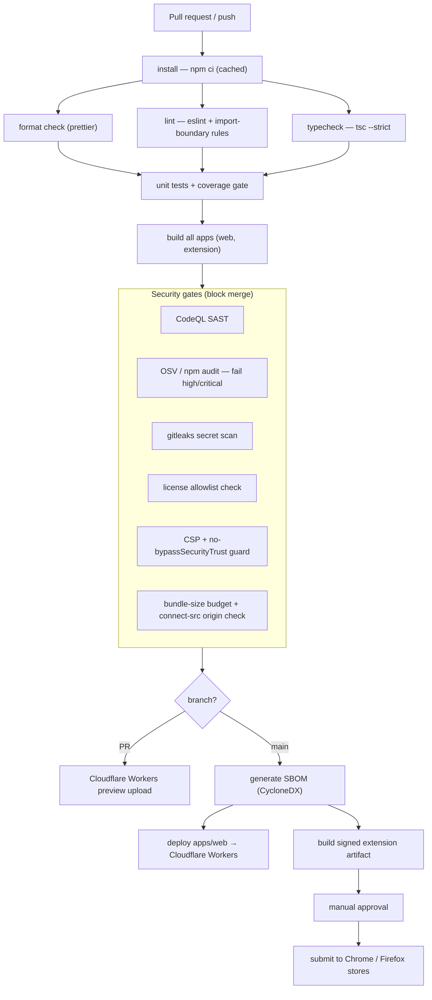

# CI/CD Architecture — Cairn

CI/CD is **mandatory infrastructure**
([ADR-0022](adr/0022-ci-cd-is-mandatory-infrastructure.md)), present from day one. It is
the sole path to production and the enforcement point for the security posture in
[SECURITY.md](../SECURITY.md).

## Principles

- **Every merge to `main` is releasable.** No half-finished state on the main branch.
- **The pipeline is the only way to deploy.** No manual builds, no drag-and-drop uploads.
- **Security gates are non-bypassable.** SAST, dependency, secret, and license checks
  block merge.
- **Fast feedback.** Cache aggressively; keep PR turnaround to a few minutes.
- **Reproducible builds.** `npm ci` against a committed lockfile; pinned tool versions.
- **$0 infrastructure.** GitHub Actions (free for public repos) + free static hosting
  ([ADR-0004](adr/0004-static-first-web-app-on-free-hosting.md)).

## Platform

| Concern | Choice |
|---------|--------|
| CI runner | GitHub Actions |
| SAST | CodeQL (JavaScript/TypeScript) |
| Dependency scanning | OSV-Scanner + `npm audit` |
| Secret scanning | gitleaks (CI + pre-commit) |
| SBOM | CycloneDX, on release |
| Preview hosting | Cloudflare Workers preview (`wrangler versions upload`) |
| Production hosting | Cloudflare Workers static assets |
| Dependency updates | Renovate (or Dependabot) |

## Pipeline

### Stage detail

| Stage | Tool | Fails the build when |
|-------|------|----------------------|
| install | `npm ci` | lockfile out of sync |
| format check | Prettier `--check` | unformatted files |
| lint | ESLint | lint errors; `apps/*` → `libs/*` boundary violations ([ADR-0005](adr/0005-angular-typescript-shared-core-monorepo.md)) |
| typecheck | `tsc --noEmit` (strict) | any type error |
| unit tests | project runner (Jest/Vitest) | test failure or coverage below threshold |
| build | Angular build + extension bundler | build error; output exceeds size budget |
| CodeQL | GitHub CodeQL | new high-severity alert |
| dependency scan | OSV-Scanner, `npm audit` | high/critical advisory with no reviewed waiver |
| secret scan | gitleaks | any secret-shaped match |
| license check | license-checker + allowlist | disallowed license in the dependency tree |
| CSP guard | custom script | `unsafe-inline`/`unsafe-eval` in the CSP; `bypassSecurityTrust`/unsanitised `innerHTML` in source ([ADR-0019](adr/0019-security-first-rendering.md)) |
| bundle origin check | custom script | production bundle references an origin not in the documented `connect-src` allowlist |
| SBOM | CycloneDX | (release only) generation failure |

## Branch protection & conventions

- `main` is protected: no direct pushes, linear history, all checks required, ≥1 review.
- **Conventional Commits**; changelog generated from commit history; **SemVer** tags.
- Environment protection rules on the `production` environment; deploy tokens scoped to
  it.
- CI workflows declare least-privilege `permissions:`; third-party actions pinned by
  commit SHA ([ADR-0021](adr/0021-supply-chain-and-dependency-security.md)).
- Fork PRs do not receive repository secrets; deploy/preview steps that need secrets are
  skipped for forks and run after a maintainer label.

## Per-app builds

`apps/web` and `apps/extension` build independently from shared `libs/*` source. Today
this is plain npm scripts run in a matrix. When build time or redundant work justifies
it, adopt Nx for its affected-graph and remote cache — tracked as a future ADR
([ADR-0005](adr/0005-angular-typescript-shared-core-monorepo.md)).

## Secrets in CI

| Secret | Used by | Scope |
|--------|---------|-------|
| `CLOUDFLARE_PAGES_TOKEN` | production + preview deploy | token needs **Workers Scripts: Edit** (name kept for continuity) |
| `CLOUDFLARE_ACCOUNT_ID` | production + preview deploy | account identifier |
| `CHROME_STORE_*` / `FIREFOX_AMO_*` | extension submission (manual gate) | store upload only |

No application runtime secrets exist ([SECURITY.md §5](../SECURITY.md#5-secrets-management)).
The premium license-signing key is **not** in CI for the web build — it lives in the
hosted-store fulfilment flow only.

## Local parity

`npm run verify` runs format + lint + typecheck + unit tests locally. Pre-commit hooks
run gitleaks and format/lint on staged files. CI is the backstop, not the only line of
defence.
